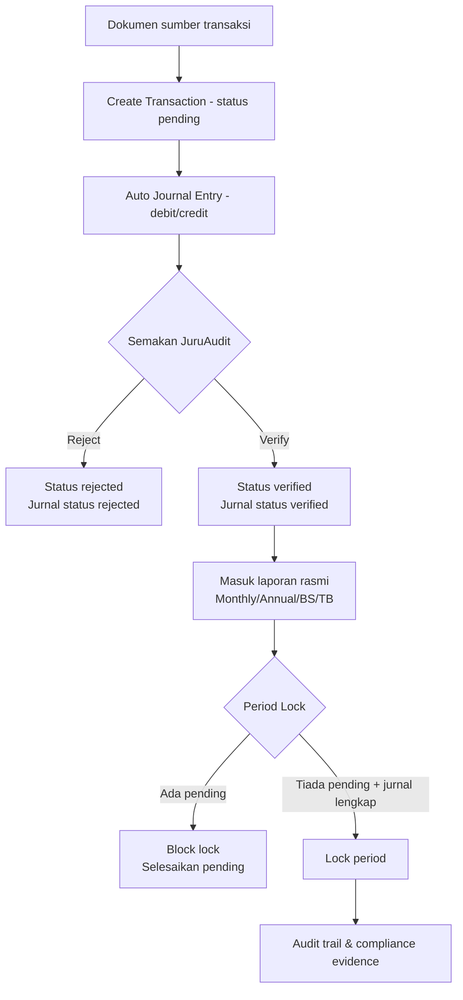

# ACCA Accounting Process Flow Alignment

Dokumen ini mendefinisikan aliran proses perakaunan sistem mengikut amalan standard kitaran perakaunan (ACCA accounting cycle) dan memetakan setiap langkah kepada endpoint sedia ada.

## 1) Accounting Cycle (Rujukan ACCA)

Kitaran standard yang digunakan:

1. Kenal pasti dan klasifikasi transaksi dari dokumen sumber.
2. Rekod transaksi ke jurnal (double-entry debit/kredit).
3. Posting ke ledger / chart of accounts.
4. Semakan imbangan duga (trial balance) dan semakan ralat.
5. Pelarasan dan pengesahan (review/approval controls).
6. Penyediaan laporan kewangan (P&L, balance sheet, cash flow, ringkasan).
7. Penutupan tempoh (period close/lock) selepas semakan lengkap.
8. Audit trail dan jejak pematuhan.

## 2) Pemetaan Ke Sistem

### 2.1 Capture & Journalize

- Cipta transaksi: `POST /api/accounting-full/transactions`
- Jurnal automatik (double-entry) dicipta untuk setiap transaksi.
- Semak jurnal transaksi: `GET /api/accounting-full/transactions/{id}/journal`

### 2.2 Posting / CoA

- Carta akaun: `GET /api/accounting-full/chart-of-accounts`
- Kategori akaun: `GET /api/accounting-full/categories`
- Akaun bank: `GET /api/accounting-full/bank-accounts`

### 2.3 Review & Verification Control

- Senarai menunggu pengesahan: `GET /api/accounting-full/pending-verification`
- Sahkan/tolak transaksi: `POST /api/accounting-full/transactions/{id}/verify`
- Audit log tindakan: `GET /api/accounting-full/audit-logs`

### 2.4 Reporting

- Laporan bulanan: `GET /api/accounting-full/reports/monthly`
- Laporan tahunan: `GET /api/accounting-full/reports/annual`
- Balance sheet: `GET /api/accounting-full/reports/balance-sheet`
- Trial balance / AGM reports:
  - `GET /api/accounting-full/agm/trial-balance`
  - `GET /api/accounting-full/agm/income-expenditure`
  - `GET /api/accounting-full/agm/balance-sheet`
  - `GET /api/accounting-full/agm/cash-flow`

### 2.5 Period Close / Lock

- Kunci tempoh: `POST /api/accounting-full/period-locks`
- Senarai lock: `GET /api/accounting-full/period-locks`
- Buka kunci tempoh: `DELETE /api/accounting-full/period-locks/{year}/{month}`

## 3) Guardrail Pematuhan Yang Dikuatkuasakan

Flow kawalan yang dikuatkuasakan dalam kod:

- Transaksi hanya boleh dikemaskini/dipadam ketika status `pending`.
- Semasa transaksi `pending` dikemaskini, jurnal di-*upsert* semula supaya debit/kredit kekal konsisten.
- Semasa transaksi dipadam (soft delete), status jurnal ditanda `void` (rekod audit dikekalkan).
- Semasa verify/reject, status jurnal diselaraskan kepada status transaksi.
- Kunci tempoh ditolak jika masih ada transaksi `pending` dalam tempoh tersebut.
- Sebelum lock period, transaksi `verified` untuk tempoh tersebut disemak/sync semula ke jurnal.
- Laporan kewangan rasmi menggunakan transaksi `verified` sahaja.

## 4) Flowchart Proses



## 5) Nota Implementasi Operasi

- Untuk semakan regresi automatik:
  - `backend/scripts/smoke_accounting_full_postgres.py`
  - `backend/scripts/smoke_accounting_legacy_postgres.py`
  - `backend/scripts/run_smoke_stability_gate.py`
- Untuk bukti readiness cutover:
  - `backend/scripts/generate_cutover_readiness_report.py`

## 6) Rujukan Flow Mesra Pengguna (Bank Reconciliation)

Untuk flow khusus pengguna tanpa latar belakang accounting bagi proses upload statement bank + auto-reconcile + remark + approval, rujuk:

- `docs/BANK_STATEMENT_AUTO_RECONCILIATION_FLOW.md`

Dokumen tersebut meliputi:

- langkah wizard end-to-end (simple language),
- hak akses `admin/bendahari/sub_bendahari/juruaudit`,
- remark fields yang wajib untuk tindakan manual,
- cadangan terbaik (CSV-first + confidence matching + maker-checker).

## 7) Status Implementasi Bank Reconciliation (MVP)

Flow `bank statement auto-reconciliation` kini tersedia pada backend melalui route:

- `POST /api/accounting-full/bank-reconciliation/statements/upload`
- `GET /api/accounting-full/bank-reconciliation/statements`
- `GET /api/accounting-full/bank-reconciliation/statements/{statement_id}`
- `GET /api/accounting-full/bank-reconciliation/profiles`
- `POST /api/accounting-full/bank-reconciliation/profiles`
- `PUT /api/accounting-full/bank-reconciliation/profiles/{profile_id}`
- `POST /api/accounting-full/bank-reconciliation/{statement_id}/auto-match`
- `GET /api/accounting-full/bank-reconciliation/{statement_id}/items`
- `POST /api/accounting-full/bank-reconciliation/{statement_id}/bulk-action`
- `POST /api/accounting-full/bank-reconciliation/{statement_id}/items/{item_id}/manual-match`
- `POST /api/accounting-full/bank-reconciliation/{statement_id}/items/{item_id}/remark`
- `POST /api/accounting-full/bank-reconciliation/{statement_id}/items/{item_id}/adjust`
- `POST /api/accounting-full/bank-reconciliation/{statement_id}/submit`
- `POST /api/accounting-full/bank-reconciliation/{statement_id}/approve`
- `POST /api/accounting-full/bank-reconciliation/{statement_id}/reject`

UI wizard untuk operasi harian berada di:

- `/admin/accounting/bank-reconciliation`
- onboarding helper + bulk review tools tersedia terus dalam wizard tersebut.
- Sokongan multi-akaun bank aktif: pengguna boleh tapis statement ikut `bank_account_id` dan reconcile setiap akaun secara berasingan dalam sistem yang sama.
- Ringkasan status per akaun bank (in-progress/ready/approved/unresolved) dipaparkan untuk membantu prioriti semakan harian.
- Queue kerja prioriti (review -> difference alert -> ready for approval) dipaparkan untuk mengurangkan kekeliruan admin/bendahari/sub bendahari.
- Checklist SOP visual + pengesan anomali dipaparkan dalam UI untuk kesan awal ralat/ketidakpastian sebelum submit/approve.
- Manual Match Picker (dropdown calon transaksi + fallback ID manual) membantu pengguna non-accounting membuat padanan manual dengan lebih selamat.
- Butang `Cadang Terbaik` menggunakan rule konservatif (score/amount/date/gap) untuk memilih calon yang paling selamat tanpa auto-approve.
- Template/auto-fill remark untuk tindakan manual & bulk membantu pematuhan audit trail tanpa membebankan operator bukan accounting.
- `Mode Ringkas Harian` ditambah (Review -> Match -> Submit) supaya operator tanpa latar belakang accounting hanya fokus 3 tindakan utama.
- Pengesan anomali kini memberi amaran tambahan jika kadar matched terlalu rendah (petanda kemungkinan akaun bank/period dipilih tidak tepat).
- `Quick Action Selesai Hari Ini` ditambah pada senarai statement untuk fokus hanya statement kritikal harian.
- `Guard submit pintar` memaparkan sebab lock dengan jelas (contoh unresolved/difference/status belum sesuai) sebelum hantar kelulusan.
- `Template SOP ikut peranan` dipaparkan terus dalam wizard untuk `admin`, `bendahari`, `sub_bendahari`, dan `juruaudit`.
- `AI Smart Reconcile` (ML-style scoring + risk model) ditambah untuk cadangan konfigurasi auto-match, unjuran automasi, dan amaran risiko sebelum tindakan operator.
- Laporan AGM ditambah `kawalan kualiti` + `professional header metadata` (rujukan laporan, basis penyediaan) untuk kurangkan risiko ralat laporan pembentangan.
- Queue statement kini disusun dengan `AI auto-priority harian` (risiko + due period) supaya bendahari fokus kerja paling kritikal dahulu.
- `Kad Tindakan Seterusnya` ditambah di bahagian atas wizard untuk terus pandu operator kepada langkah paling penting semasa.
- Label status ditukar kepada BM penuh dengan tooltip penerangan bagi kurangkan salah tafsir pengguna non-accounting.
- `Bulk Action` kini guna wizard `Pilih Aksi -> Preview Impak -> Sahkan`, bagi mengelakkan kesilapan bulk update tanpa semakan.
- Auto-notification peranan (`admin`/`bendahari`/`sub_bendahari`) kini dihantar automatik ke pusat notifikasi apabila statement masuk kategori `Kritikal` atau `Overdue`, dengan dedupe + cooldown untuk elak spam.
- `Notification Bell` kini ada microcopy BM khusus untuk notifikasi `bank_reconciliation_alert` (tajuk, badge konteks, CTA), supaya tindakan susulan lebih jelas untuk operator non-accounting.
- Kandungan notifikasi `bank_reconciliation_alert` kini dipersonalisasi ikut role penerima (`admin`/`bendahari`/`sub_bendahari`) termasuk arahan tindakan (role guidance), agar mesej lebih tepat kepada tanggungjawab semasa.
- `Notification Bell` kini guna tone warna ikut peranan (admin/bendahari/sub-bendahari) dan override `Kritikal/Overdue` supaya risiko + pemilik tindakan boleh dikenal pasti lebih pantas.

## 8) Unified Central Cart (Troli Berpusat) - Status Semasa

Semua aliran bayaran parent kini diseragamkan kepada konsep "add to cart dahulu, checkout sekali di Pusat Bayaran" untuk kawalan audit, konsistensi posting accounting, dan UX operator yang lebih jelas.

### 8.1 Prinsip operasi

- Satu troli berpusat untuk semua kategori: `yuran`, `yuran_partial`, `yuran_installment`, `yuran_two_payment`, `koperasi`, `bus`, `infaq/tabung`, `marketplace`.
- Semua checkout rasmi berlaku di `GET /payment-center?tab=troli`.
- Pembayaran final dijana melalui `POST /api/payment-center/checkout` dan menghasilkan resit + posting accounting.

### 8.2 Indikator troli global (header)

- Ikon troli global dipaparkan di header kanan sebelah nama pengguna.
- Paparan ringkasan kategori ditambah untuk rujukan pantas operator:
  - `YR` (Yuran)
  - `KP` (Koperasi)
  - `BS` (Tiket Bas)
  - `SB` (Sumbangan/Tabung)
  - `MP` (Marketplace)
- Klik indikator membuka drawer troli yang sama (single source of truth).

### 8.3 Canonical route dan alias legacy

- Canonical route sumbangan/logged-in user: `/tabung`.
- Alias legacy parent kini redirect ke canonical flow:
  - `/sedekah` -> `/tabung` (untuk user login)
  - `/infaq` -> `/tabung`
  - `/donate/:campaignId` -> `/tabung` (untuk user login)
- Alias legacy admin:
  - `/admin/sedekah` -> `/admin/tabung`
  - `/admin/infaq` -> `/admin/tabung`

### 8.4 Implikasi kawalan accounting

- Modul `tabung/sedekah/infaq` dan `bus` tidak lagi memproses bayaran akhir secara direct dari page legacy; transaksi dibawa masuk ke troli berpusat dahulu.
- Checkout pusat memastikan:
  - rekod resit konsisten,
  - posting accounting berlaku di satu pintu,
  - jejak audit dan rekonsiliasi lebih mudah disemak.

## 9) Model Hibrid Invoice + Billing Pack (Cadangan Minimum DB)

Objektif model hibrid:

- Kekalkan 1 invoice utama per pelajar per tahun/tingkatan (mudah untuk AR, aging, audit).
- Benarkan pecahan operasi kepada 2-3 `billing pack` untuk kes khas sahaja.
- Elak pecahkan invoice mengikut setiap sub-kategori item (terlalu kompleks untuk operasi sekolah).

### 9.1 Prinsip data (minimum change)

- Guna struktur sedia ada `student_yuran` sebagai sumber invoice utama.
- Tambah metadata pack dalam rekod invoice, bukan cipta collection invoice baru.
- Item masih kekal sebagai line item (detail accounting), pack hanya layer operasi bayaran.

### 9.2 Field minimum pada `student_yuran`

Tambahan field dicadangkan:

- `billing_pack_enabled: bool`  
  `true` jika invoice ini guna mode pack.
- `billing_pack_mode: str`  
  Nilai: `single` | `hybrid`.
- `billing_packs: []`  
  Senarai pack (maks 3).

Struktur setiap `billing_packs[]`:

- `pack_id: str` (uuid/short id)
- `pack_code: str` (contoh: `PK1`, `PK2`, `PK3`)
- `pack_name: str` (contoh: `Teras Wajib`, `Aktiviti`, `Lawatan Khas`)
- `sequence: int` (1..3)
- `amount: float`
- `paid_amount: float`
- `status: str` (`pending` | `partial` | `paid` | `overdue`)
- `due_date: str` (ISO date)
- `item_codes: []` (kod item yang termasuk dalam pack)
- `is_special_case: bool`
- `notes: str`
- `created_by: str`
- `created_at: str`
- `updated_at: str`

Tambahan field optional pada line item `items[]`:

- `pack_id: str` (rujuk `billing_packs.pack_id`)
- `charge_type: str` (contoh: `core`, `club`, `association`, `trip`, `special`)

### 9.3 Guardrail (wajib)

- `billing_packs.length <= 3`
- Semua `item_codes` mesti valid dan unik merentasi pack.
- `sum(pack.amount) == total_amount` (toleransi rounding kecil, contoh 0.01).
- `sum(pack.paid_amount) == paid_amount` (toleransi rounding kecil).
- `status` pack dan status invoice mesti konsisten (derived, bukan manual bebas).

### 9.4 Migrasi ringkas dari sistem semasa

- Rekod lama: set `billing_pack_enabled=false`, `billing_pack_mode=single`.
- Jika perlu aktifkan hybrid untuk invoice tertentu:
  1. Jana `PK1` default dari semua item semasa.
  2. Re-map item terpilih ke `PK2/PK3` (kes khas sahaja).
  3. Recalculate amount/status.
- Tiada keperluan pecah semula nombor invoice legacy.

## 10) Cadangan UI Praktikal Bendahari: Page `Caj Tambahan`

Tujuan page:

- Urus caj selain pakej yuran teras (Persatuan, Kelab, Lawatan, aktiviti khas).
- Boleh kenakan caj kepada kumpulan sasaran (tingkatan/kelas/kelab) atau pelajar terpilih.
- Jana invoice/line item secara pukal dengan audit trail jelas.

### 10.1 Lokasi menu dan route

- Menu: `Kewangan -> Caj Tambahan`
- Route dicadang: `/admin/yuran/charges`
- Role: `admin`, `bendahari`, `sub_bendahari`, `superadmin`

### 10.2 Aliran UI (1 halaman, 4 langkah)

1. **Tetapan Caj**
   - Jenis caj: `Persatuan` | `Kelab` | `Lawatan` | `Aktiviti Khas`
   - Nama caj, kod caj, amount, due date, tahun.
   - Pilihan: `Sekali sahaja` atau `boleh ulang`.

2. **Pilih Sasaran**
   - Tahun, Tingkatan, Kelas (optional), Kelab/Persatuan (optional).
   - Toggle: `Semua pelajar sasaran` atau `Pilih manual`.
   - Jadual pelajar dengan checkbox + carian.

3. **Preview Impak**
   - Bil pelajar terlibat, jumlah keseluruhan, expected AR.
   - Mod posting:  
     - `Tambah ke invoice sedia ada (pending/partial)`  
     - `Cipta invoice baharu (kes khas sahaja)`
   - Amaran jika ada invoice paid (skip by default).

4. **Sahkan & Jana**
   - Butang `Jana Pukal`.
   - Papar ringkasan job: `berjaya`, `skip`, `error`.
   - Simpan audit log + id job untuk rujukan.

### 10.3 Komponen penting dalam page

- **Filter bar:** Tahun, Tingkatan, Kelas, Kelab.
- **Target list table:** checkbox, nama pelajar, no matrik, status invoice semasa.
- **Summary card:** bilangan sasaran, jumlah caj, overdue risk.
- **Dry-run panel:** "Apa akan berlaku" sebelum commit.
- **Result drawer:** log per pelajar (berjaya/skip/error).

### 10.4 API minimum (cadangan)

- `POST /api/yuran/charges/preview`
- `POST /api/yuran/charges/apply`
- `GET /api/yuran/charges/jobs`
- `GET /api/yuran/charges/jobs/{job_id}`

Payload minimum:

- `charge_name`, `charge_code`, `charge_type`, `amount`, `due_date`
- `tahun`, `target_scope` (`tingkatan`/`kelas`/`kelab`/`manual`)
- `target_ids[]` (student_ids)
- `apply_mode` (`append_existing_invoice` | `new_invoice_special_case`)

### 10.5 Kenapa model ini paling praktikal

- Mesra operator bukan accounting (tak perlu urus terlalu banyak invoice kecil).
- AR dan aging kekal kuat (satu sumber invoice + line item terperinci).
- Laporan AGM kekal bersih (ringkasan per invoice, detail per item/pack).
- Mudah migrasi dari struktur semasa `student_yuran`.

## 11) Spesifikasi Teknikal Implementasi Fasa 1 (Build-Ready)

Fasa 1 fokus kepada aliran minimum yang terus boleh digunakan bendahari:

- tambah caj tambahan kepada sasaran terpilih (tingkatan/kelas/kelab/manual),
- preview impak sebelum commit,
- apply pukal dengan audit trail dan job tracking.

### 11.1 Scope Fasa 1

Dalam skop:

- `append_existing_invoice` untuk invoice `pending/partial`.
- `new_invoice_special_case` untuk kes khas (jika invoice sedia ada `paid`/tiada).
- metadata `billing_packs` maks 3 pack.
- page `Caj Tambahan` (preview -> apply -> lihat job result).

Luar skop (fasa seterusnya):

- auto-scheduler caj berkala,
- approval workflow berlapis (maker-checker khas caj tambahan),
- rule engine kompleks per aktiviti.

### 11.2 Schema Patch (minimum, selamat migrasi)

#### A) Patch `student_yuran_records` (PostgreSQL typed table)

Tambah kolum:

- `billing_pack_enabled` `BOOLEAN NOT NULL DEFAULT FALSE`
- `billing_pack_mode` `VARCHAR(16) NOT NULL DEFAULT 'single'`
- `billing_packs` `JSON NOT NULL DEFAULT '[]'`
- `charge_context` `JSON NULL`

Index dicadang:

- `ix_student_yuran_records_pack_enabled` (`billing_pack_enabled`)
- `ix_student_yuran_records_pack_mode` (`billing_pack_mode`)

Alembic revision dicadang:

- `20260312_01_add_billing_pack_fields_to_student_yuran_records.py`

#### B) Patch model SQL (`backend/models_sql/yuran_tables.py`)

Pada `StudentYuranRecord` tambah mapped column setara:

- `billing_pack_enabled: Mapped[bool]`
- `billing_pack_mode: Mapped[str]`
- `billing_packs: Mapped[list]`
- `charge_context: Mapped[dict]`

#### C) Patch dokumen runtime (Mongo/CoreStore)

Untuk kes kompatibiliti `core_documents`:

- dokumen lama default:
  - `billing_pack_enabled=false`
  - `billing_pack_mode='single'`
  - `billing_packs=[]`
- `charge_context` hanya wujud apabila caj tambahan digunakan.

Skrip backfill dicadang:

- `backend/scripts/backfill_billing_pack_defaults.py`

#### D) Table job tracking (baru)

Table/collection: `yuran_charge_jobs`

Field minimum:

- `id`, `job_number`, `status` (`previewed|processing|completed|partial|failed`)
- `charge_payload` (JSON)
- `target_summary` (JSON)
- `result_summary` (JSON)
- `result_rows` (JSON, optional capped)
- `created_by`, `created_at`, `started_at`, `completed_at`

Alembic revision dicadang:

- `20260312_02_create_yuran_charge_job_records.py`

### 11.3 Kontrak API Fasa 1

#### 1) `POST /api/yuran/charges/preview`

Tujuan:

- kira impak tanpa menulis data.

Request minimum:

- `charge_name`, `charge_code`, `charge_type`
- `amount`, `due_date`, `tahun`
- `target_scope`: `tingkatan|kelas|kelab|manual`
- `target_filters` (ikut scope)
- `target_ids[]` (wajib jika `manual`)
- `apply_mode`: `append_existing_invoice|new_invoice_special_case`
- `pack_config`:
  - `enabled` bool
  - `mode` (`single|hybrid`)
  - `packs[]` (maks 3, optional)

Response minimum:

- `preview_id`
- `target_count`
- `eligible_count`
- `append_count`
- `new_invoice_count`
- `skip_paid_count`
- `estimated_total`
- `warnings[]`
- `sample_rows[]`

#### 2) `POST /api/yuran/charges/apply`

Tujuan:

- commit caj tambahan berdasarkan payload yang sama (atau `preview_id`).

Request minimum:

- semua field preview + `preview_id` (optional tapi disyorkan)
- `confirm: true`

Response minimum:

- `job_id`, `job_number`, `status`
- `processed_count`, `success_count`, `skip_count`, `error_count`
- `total_delta_amount`
- `result_summary`

#### 3) `GET /api/yuran/charges/jobs`

Filter:

- `status`, `tahun`, `charge_type`, `created_by`, `date_from`, `date_to`, `page`, `limit`

Response:

- senarai job + ringkasan.

#### 4) `GET /api/yuran/charges/jobs/{job_id}`

Response:

- payload asal, ringkasan impak, senarai row berjaya/skip/error.

### 11.4 Logik Apply (server-side)

Urutan proses (ringkas):

1. Resolve sasaran pelajar ikut scope/filter.
2. Validasi payload + guardrail:
   - pack max 3,
   - item code unik,
   - jumlah pack valid.
3. Untuk setiap pelajar:
   - cari invoice `student_yuran` tahun sasaran,
   - jika mode `append_existing_invoice`:
     - jika status `pending/partial` -> tambah line item caj,
     - jika `paid` -> skip (default) atau ikut mode special.
   - jika mode `new_invoice_special_case`:
     - cipta invoice khas dengan `billing_mode='special_charge'`.
4. Kemas kini:
   - `items[]`, `total_amount`, `balance`, `status`,
   - `billing_pack_*` field jika hybrid aktif,
   - `invoice_adjustments[]` (rujuk pola `_sync_set_changes_to_existing_invoices`).
5. Audit & notifikasi:
   - log `audit_logs`,
   - notifikasi parent (in-app/email template).
6. Simpan hasil ke `yuran_charge_jobs`.

### 11.5 Wireframe Komponen Page `Caj Tambahan`

Cadangan struktur komponen:

- `ChargesFilterBar`
- `ChargesSetupForm`
- `ChargesTargetSelectorTable`
- `ChargesPreviewPanel`
- `ChargesApplyFooter`
- `ChargesJobResultDrawer`
- `ChargesJobHistoryTable`

Wireframe (desktop):

```text
+----------------------------------------------------------------------------------+
| Caj Tambahan                                                                    |
| [Tahun] [Scope: Tingkatan/Kelas/Kelab/Manual] [Tingkatan] [Kelas] [Kelab]      |
+----------------------------------------------------------------------------------+
| Tetapan Caj                                                                      |
| Nama Caj | Kod Caj | Jenis Caj | Amaun | Due Date | Apply Mode                  |
| [Billing Pack toggle] [single/hybrid] [Tambah Pack] (maks 3)                    |
+----------------------------------------------------------------------------------+
| Senarai Sasaran Pelajar                                                          |
| [Search] [Select All]                                                            |
| [x] Nama Pelajar | No Matrik | Tingkatan | Invoice Status | Baki Semasa         |
+----------------------------------------------------------------------------------+
| Preview Impak                                                                    |
| Target: 120 | Eligible: 103 | Skip Paid: 17 | Est. Delta: RM 12,360.00          |
| Warnings: ...                                                                    |
+----------------------------------------------------------------------------------+
| [Preview] [Jana Pukal]                                                           |
+----------------------------------------------------------------------------------+
| Job Result Drawer                                                                |
| Success / Skip / Error + muat turun log                                          |
+----------------------------------------------------------------------------------+
```

### 11.6 Acceptance Criteria Fasa 1

- Bendahari boleh preview sebelum apply (tiada write semasa preview).
- Apply pukal berjaya untuk minimum 1 cohort tingkatan penuh.
- Job result boleh diaudit semula melalui endpoint jobs.
- AR summary dan laporan yuran kekal konsisten selepas apply.
- Tiada regression pada flow parent payment center + receipt.
